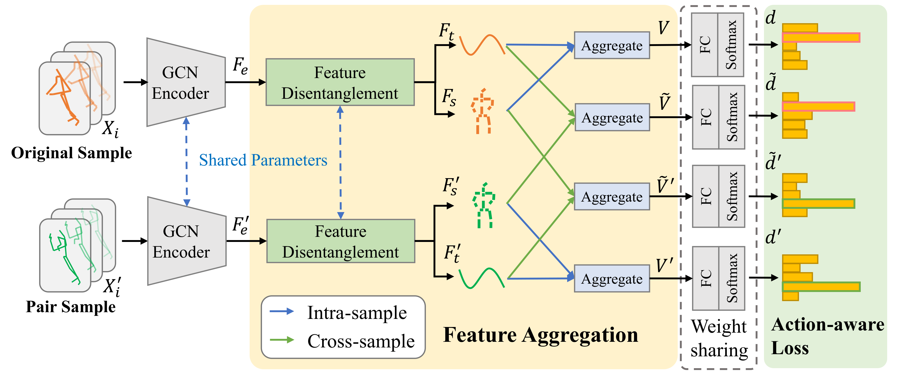

# SkeletonX
This repo is the official implementation for [SkeletonX: Data-Efficient Skeleton-based Action Recognition via Cross-sample Feature Aggregation](https://arxiv.org/abs/2504.11749).

## Architecture



# Prerequisites
- Anaconda (or Miniconda)
- Python >= 3.6
- PyTorch >= 1.1.0
- PyYAML, tqdm, tensorboardX
- Run `pip install -r requirements.txt`
- Run `pip install -e torchlight` 

We have tested the following configurations on NVIDIA RTX 2080 Ti and V100 GPU.

```bash
conda create -n skeletonx python=3.6
conda activate skeletonx
conda install pytorch==1.1.0 torchvision==0.3.0 cudatoolkit=10.0 -c pytorch
pip install -r requirements.txt
pip install -e torchlight
```

# Data Preparation

### Downloading datasets

**There are 3 datasets to download**:

- NTU RGB+D 60 Skeleton
- NTU RGB+D 120 Skeleton
- PKU-MMD (Phase II)

#### NTU RGB+D 60 and 120

1. Request dataset here: https://rose1.ntu.edu.sg/dataset/actionRecognition
2. Download the skeleton-only datasets:
   1. `nturgbd_skeletons_s001_to_s017.zip` (NTU RGB+D 60)
   2. `nturgbd_skeletons_s018_to_s032.zip` (NTU RGB+D 120)
   3. Extract the above files to `./data/nturgbd_raw`

#### PKU-MMD

1. Download PKU-MMD (Phase II) skeleton-only dataset here: https://www.icst.pku.edu.cn/struct/Projects/PKUMMD.html
2. Extract `Skeleton_v2.7z` to `./data/PKUMMDv2/skeletons`
3. Extract `Label_PKUMMD_v2.zip` to `./data/PKUMMDv2/label`

### Data Processing

#### Directory Structure

Put the downloaded data into the following directory structure:

```
- data/
  - ntu/
  - ntu120/
  - PKUMMDv2/
    - skeletons/
      - A01N01-L.txt
      ...                     # from `Skeleton_v2.7z`
    - label/
      - A01N01-L.txt
      ...                     # from `Label_PKUMMD_v2.7z`
  - nturgbd_raw/
    - nturgb+d_skeletons/     # from `nturgbd_skeletons_s001_to_s017.zip`
      ...
    - nturgb+d_skeletons120/  # from `nturgbd_skeletons_s018_to_s032.zip`
      ...
```

#### Generating Data

Generate NTU RGB+D 60 or NTU RGB+D 120 dataset:

```
 cd ./data/ntu # or cd ./data/ntu120
 # Get skeleton of each performer
 python get_raw_skes_data.py
 # Remove the bad skeleton 
 python get_raw_denoised_data.py
 # Transform the skeleton to the center of the first frame
 python seq_transformation.py
```

Generate PKU-MMDv2 dataset:

```
 cd ./data/PKUMMDv2
 # Get skeleton of each performer
 python raw_data_output.py
 # Remove the bad skeleton and generate NTU-format files
 python transform_to_current_format.py
 # Transform the skeleton to the center and generate npz files
 python seq_transformation.py
```

#### Generating One-shot and Limited-scale sample info

Generate `train_indices_info_*.csv` for limited-scale training and one-shot training.

```
 cd ./data/ntu # or `cd ./data/ntu120`, `cd ./data/PKUMMDv2`
 # Generate one-shot data and sample info
 python seq_transformation_1Shot.py
 # Generate limited-scale data
 python seq_transformation_LimBudget.py
```

After finishing the procedures above, the directories should include:

```
- data/
  - ntu/
    - NTU60_CS.npz
    - NTU60_1Shot.npz
    - NTU60_LimBudget_*.npz
    - train_indices_info_*.csv
    - one-shot_anchor_info.csv
    - one-shot_aux_info.csv
    - one-shot_eval_info.csv
  - ntu120
    - NTU120_CSub.npz
    - NTU120_1Shot.npz
    - NTU120_LimBudget_*.npz
    - train_indices_info_*.csv
    - one-shot_anchor_info.csv
    - one-shot_aux_info.csv
    - one-shot_eval_info.csv
  - PKUMMDv2
    - PKUMMDv2_CSub.npz
    - PKUMMDv2_1Shot.npz
    - PKUMMDv2_LimBudget_*.npz
    - train_indices_info_*.csv
    - one-shot_anchor_info.csv
    - one-shot_aux_info.csv
    - one-shot_eval_info.csv
```

# Evaluation

## Download Pretrained Models

Download our pretrained model from [huggingface](https://huggingface.co/SteveZh/SkeletonX) or [Baidu Netdisk](https://pan.baidu.com/s/13k0nJBb2Jek7b0pYcoyf5A?pwd=894t) and put it into `checkpoints`.

The directory tree should be organized like this:

```
- checkpoints/
  - one_shot/
    - ctrgcn_w-ours_ntu.pt
    - ctrgcn_w-ours_ntu120.pt
    - ctrgcn_w-ours_pkummdv2.pt
  - limited_scale/
    - CTR-GCN/
      - ntu/
      - ntu120/
      - pkummdv2/
    - ST-GCN/
      - ntu/
      - ntu120/
      - pkummdv2/
    ...
```

## One-shot Setting

To evaluate the pretrained models, please use the following code:

```bash
# NTU
python main_few_shot_xmix.py --config config/ntu/one_shot/st_decouple.yaml --work-dir results/ntu/ctrgcn_w-ours_official --phase test --weights checkpoints/one_shot/ctrgcn_w-ours_ntu.pt

# NTU 120
python main_few_shot_xmix.py --config config/ntu120/one_shot/st_decouple.yaml --work-dir results/ntu120/ctrgcn_w-ours_official --phase test --weights checkpoints/one_shot/ctrgcn_w-ours_ntu120.pt

# PKUMMDv2
python main_few_shot_xmix.py --config config/pkummdv2/one_shot/st_decouple.yaml --work-dir results/pkummdv2/ctrgcn_w-ours_official --phase test --weights checkpoints/one_shot/ctrgcn_w-ours_pkummdv2.pt
```

## Limited-scale Setting

Here are some examples for evaluating on limited-scale pretrained models.

```bash
# Baseline on NTU dataset with 10 samples per category using CTR-GCN
python main_baseline.py --config config/ntu/limited_scale/base_10_LB.yaml --work-dir results/ntu/limited_scale/ctrgcn_baseline_official --model model.ctrgcn.Model --weights checkpoints/limited_scale/CTR-GCN/ntu/base_ctrgcn_LS_10.pt --phase test
# Ours on 10 NTU dataset with samples per category using CTR-GCN
python main_xmix.py --config config/ntu/limited_scale/ours_10_LB.yaml --work-dir results/ntu/limited_scale/ctrgcn_ours_official --model model.ctrgcn.Model --weights checkpoints/limited_scale/CTR-GCN/ntu/ours_ctrgcn_LS_10.pt --phase test

# Baseline on PKU-MMDv2 dataset with 10 samples per category using ST-GCN
python main_baseline.py --config config/pkummdv2/limited_scale/base_10_LB.yaml --work-dir results/pkummdv2/limited_scale/stgcn_baseline_official --model model.stgcn.Model --weights checkpoints/limited_scale/ST-GCN/pkummdv2/base_stgcn_LS_10.pt --phase test
# Ours on 10 NTU dataset with samples per category using ST-GCN
python main_xmix.py --config config/pkummdv2/limited_scale/ours_10_LB.yaml --work-dir results/pkummdv2/limited_scale/stgcn_ours_official --model model.stgcn.Model --weights checkpoints/limited_scale/ST-GCN/pkummdv2/ours_stgcn_LS_10.pt --phase test

# Baseline on NTU120 dataset with 30 samples per category using TCA-GCN
python main_baseline.py --config config/ntu120/limited_scale/base_30_LB.yaml --work-dir results/ntu120/limited_scale/tcagcn_baseline_official --model model.tcagcn.Model --weights checkpoints/limited_scale/TCA-GCN/ntu120/base_tcagcn_LS_30.pt --phase test
# Ours on NTU120 dataset with 30 samples per category using TCA-GCN
python main_xmix.py --config config/ntu120/limited_scale/ours_30_LB.yaml --work-dir results/ntu120/limited_scale/stgcn_ours_official --model model.tcagcn.Model --weights checkpoints/limited_scale/TCA-GCN/ntu120/ours_tcagcn_LS_30.pt --phase test
```

You can change the config and weights for other settings.

# Training

## One-shot Setting

We train the model on two NVIDIA RTX 2080 Ti GPUs. You can change the `dataset` argument for different datasets.

```bash
# dataset can be set to any of these: ['ntu', 'ntu120', 'pkummdv2']
python run_one-shot_training.py --device 0,1 --dataset ntu
```

## Limited-scale Setting

Change the config file depending on what you want. Here are two examples for training.

```bash
# Baseline on NTU dataset with 10 samples per category using ST-GCN
python main_baseline.py --config config/ntu/limited_scale/base_10_LB.yaml --work-dir results/ntu/limited_scale/stgcn_baseline_reprod --model model.stgcn.Model --device 0 1 --eval-interval 5
# Ours on 10 NTU dataset with samples per category using ST-GCN
python main_xmix.py --config config/ntu/limited_scale/ours_10_LB.yaml --work-dir results/ntu/limited_scale/stgcn_ours_reprod --model model.stgcn.Model --device 0 1 --eval-interval 5
```

## Acknowledgements

This repo is mainly based on [CTR-GCN](https://github.com/Uason-Chen/CTR-GCN), we also refer to [ST-GCN](https://github.com/yysijie/st-gcn), [2s-AGCN](https://github.com/lshiwjx/2s-AGCN), [TCA-GCN](https://github.com/OrdinaryQin/TCA-GCN), [BlockGCN](https://github.com/ZhouYuxuanYX/BlockGCN), [FR-HEAD](https://github.com/zhysora/FR-Head).

Thanks to these authors for their excellent work!

# Citation

Please cite this work if you find it useful:

```
@article{zhang2025skeletonx,
  title = {SkeletonX: Data-Efficient Skeleton-based Action Recognition via Cross-sample Feature Aggregation},
  author = {Zhang, Zongye and Cai, Wenrui and Liu, Qingjie and Wang, Yunhong},
  year = 2025,
  journal = {IEEE Transactions on Multimedia},
  publisher = {IEEE},
  volume = {},
  number = {},
  pages = {1--13},
  note = {early access, doi: {\color{blue} \href{https://doi.org/10.1109/TMM.2025.3618561}{10.1109/TMM.2025.3618561}}}
}
```
